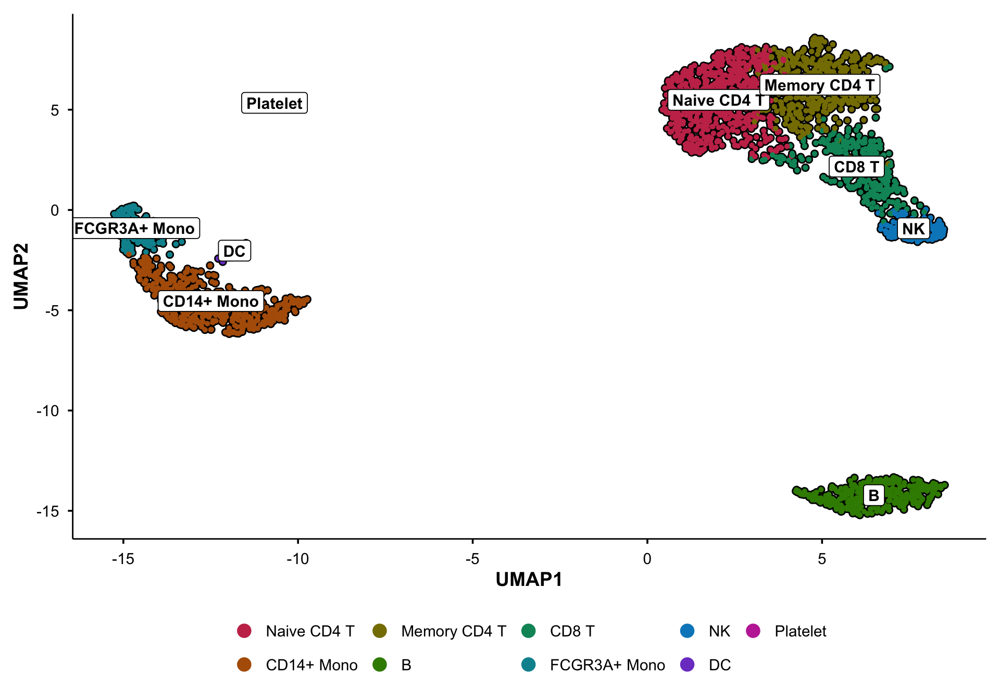
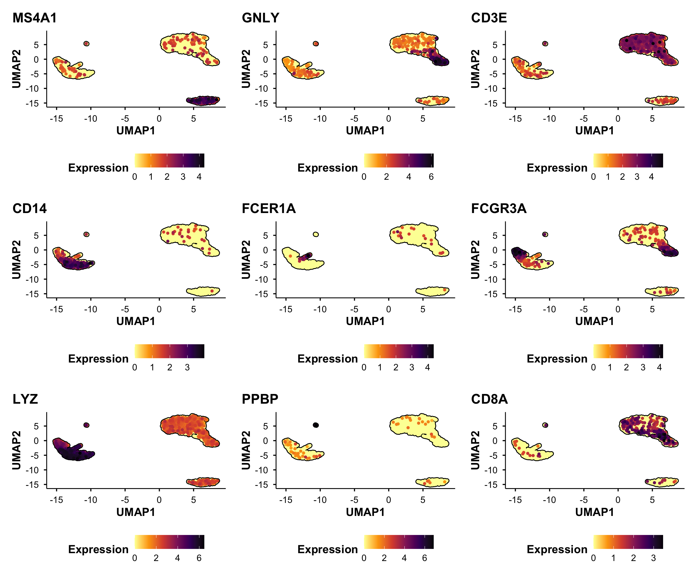
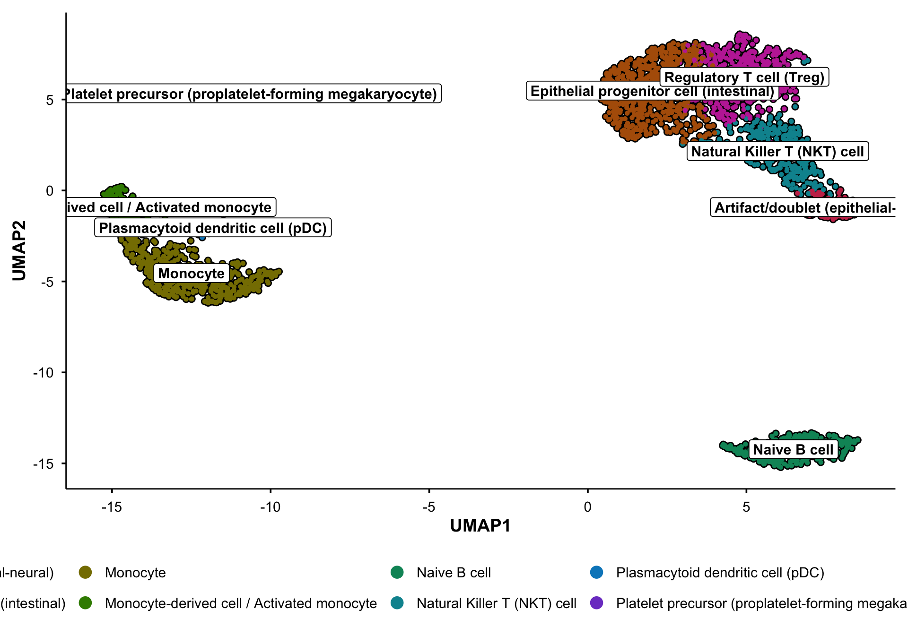
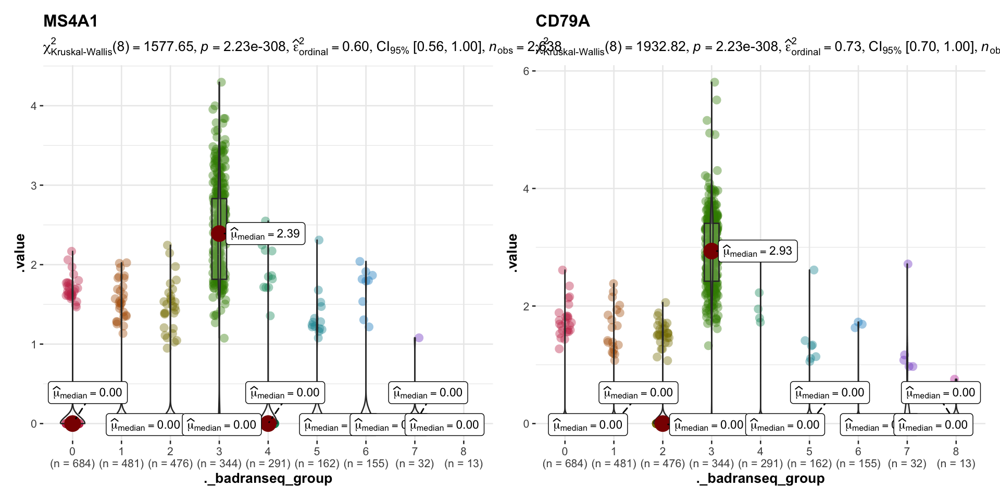

# Seurat scRNA-seq Analysis, Powered by BadranSeq & CyteTypeR

**The Seurat PBMC3k tutorial, rebuilt from scratch with publication-ready figures and automated cell-type annotation.**

Seurat's default plots get the job done — but they don't belong in a paper. This guide runs the canonical PBMC3k pipeline end-to-end, then re-renders every visualization with [BadranSeq](https://github.com/wolf5996/BadranSeq): cell borders, vivid palettes, variance-annotated axes, and statistical overlays that actually tell you something. Cell-type annotation is handled twice — first manually with canonical markers, then automatically with [CyteTypeR](https://github.com/NygenAnalytics/CyteTypeR) — so you can see how far zero-effort annotation has come.

---

## Pipeline Overview

```
PBMC3k Data                                                              Annotate
    │                                                                       ▲
    ▼                                                                       │
   QC ──→ Normalize ──→ Variable Features ──→ Scale ──→ PCA ──→ Cluster ──→ UMAP ──→ DEA ──┤
    │                                                     │        │         │               │
    │                                                     │        │         │               │
 BadranSeq                                             BadranSeq  BadranSeq BadranSeq    CyteTypeR
 fetch_cell_data()                                     do_PcaPlot  Enhanced  do_UmapPlot  Automated
 QC histograms                                         ElbowPlot   DimPlot  do_FeaturePlot Annotation
                                                                            do_ViolinPlot
```

Every step that produces a figure renders it **twice** — once with the Seurat default, once with the BadranSeq replacement — so you can compare them side by side.

---

## The Good Stuff

**Annotated UMAP** — Cell type labels with white-fill backgrounds, cell borders, and a vivid categorical palette. This is `BadranSeq::do_UmapPlot()` doing what Seurat's `DimPlot()` wishes it could:



**Marker gene expression** — Nine canonical markers across PBMC clusters, viridis color scaling with cell borders. `BadranSeq::do_FeaturePlot()` replaces Seurat's `FeaturePlot()`:



**Manual vs CyteTypeR annotation** — How do hand-curated labels compare to API-driven automated annotation? Two BadranSeq UMAPs make the comparison instant:

*Manual annotation (canonical markers + prior knowledge):*


*CyteTypeR automated annotation:*



**Statistical violin plots** — `BadranSeq::do_StatsViolinPlot()` overlays Kruskal-Wallis omnibus tests with median annotations and jittered points. No more naked violins:



---

## Why BadranSeq?

| Seurat Default | BadranSeq Replacement | Why Bother |
|---|---|---|
| `DimPlot()` | `do_UmapPlot()` | Cell borders, automatic cluster labels, vivid colour palette |
| `DimPlot(reduction = "pca")` | `do_PcaPlot()` | Auto variance-explained percentages on axes |
| `FeaturePlot()` | `do_FeaturePlot()` | Viridis colour scaling, cell borders, cleaner layout |
| `VlnPlot()` | `do_ViolinPlot()` | Boxplot overlay, median line, jittered points |
| `ElbowPlot()` | `EnhancedElbowPlot()` | Cumulative variance explained, cutoff indicator line |
| N/A | `fetch_cell_data()` | Tidy metadata extraction for custom ggplot2 QC histograms |
| Manual `RenameIdents()` | **CyteTypeR** | API-driven automated cell-type annotation + interactive HTML report |

---

## Quick Start

### 1. Install dependencies

```r
# Install Seurat and SeuratData
install.packages("Seurat")
install.packages("remotes")
remotes::install_github("satijalab/seurat-data")

# Install BadranSeq
remotes::install_github("wolf5996/BadranSeq")

# Install CyteTypeR
remotes::install_github("NygenAnalytics/CyteTypeR")
```

### 2. Render the guide

```bash
quarto render seurat_analysis_powered_by_badranseq_guide.qmd
```

The rendered HTML will appear in the same directory.

---

## Project Layout

```
seurat_analysis_powered_by_badranseq/
├── docs/              # Plans and documentation
├── read/              # Input data
├── scripts/           # Analysis code (git root)
│   ├── seurat_analysis_powered_by_badranseq_guide.qmd
│   ├── readme_figures/ # README showcase images
│   └── scripts.Rproj
├── checkpoints/       # Intermediate .rds files
└── write/
    ├── figures/        # All output figures
    └── tables/         # Marker gene tables
```

---

## Requirements

| Dependency | Version |
|---|---|
| R | >= 4.0 |
| Quarto | >= 1.3 |
| Seurat | >= 5.0 |
| SeuratData | latest |
| BadranSeq | latest (GitHub) |
| CyteTypeR | latest (GitHub) |

---

## Resources

| Resource | Link |
|---|---|
| BadranSeq | <https://github.com/wolf5996/BadranSeq> |
| CyteTypeR | <https://github.com/NygenAnalytics/CyteTypeR> |
| Seurat PBMC3k Tutorial | <https://satijalab.org/seurat/articles/pbmc3k_tutorial> |
| CyteTypeR Interactive Report | [View Report](https://nygen-labs-prod--cytetype-api.modal.run/report/34fac9e9-3c43-4c46-95f4-6b2994e57ada) |

---

**Author:** Badran Elshenawy — University of Oxford

Made with coffee and an unreasonable number of UMAP plots.
